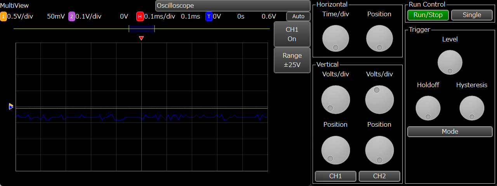

# MultiView
- [English](#English)
- [日本語](#日本語)

## English
MultiView is GUI software for ADALM2000.  
**Due to performance issues, the sampling rate is limited to 100kSa/s.**

### Features
- Interface closer to an actual oscilloscope than Scopy.

### How to use
The following Python library is required.
- [PyQt5](https://pypi.org/project/PyQt5/)
- [pyqtgraph](https://pypi.org/project/pyqtgraph/)
- [numpy](https://pypi.org/project/numpy/)
- [libm2k](https://github.com/analogdevicesinc/libm2k)

Running start.bat will start the program.

#### Oscilloscope
- Main window
	- Status bar
		- Vertical setting value display (1, 2 icons)
			- Displays the V/DIV and vertical position of each channel. Hides when the channel display is turned off.
		- Horizontal setting value display (H icon)
			- Displays TIME/DIV and horizontal position.
		- Trigger setting value display (T icon)
			- Displays trigger level, holdoff, and hysteresis.
	- Waveform display
		- Waveforms are displayed.
		- The triggering position is displayed above waveforms.
		- Trigger level and 0V level of each channel are displayed in the left part of the waveform.
	- Measurement bar
		- Displays measured values.
	- Menu
		- The menu corresponding to the button pressed on the operation panel is displayed.
- Operation Panel Window
	- Horizontal Controls (Horizontal)
		- Time/div: Sets the time per division.
		- Position: Sets the horizontal position.
	- Vertical Controls (Vertical)
		- Volts/div: Sets the voltage per division.
		- Position: Sets the vertical position.
		- CH1/CH2: Displays the menu for each channel.
			- CH1/CH2: Turns off the channel display.
			- Range: Changes the input range of the ADALM2000. **Never input signals exceeding the input range.**
	- Function Controls (Control)
		- ↺: Sets values in the menu which indicated by the "↺" symbol.
		- Auto Measure: Displays the menu for setting auto measure functions.
			- Meas1-4: Change the function of the ↺ dial to set each measurement.
			- Source: Sets measurement source.
	- Sweep Control (Run Control)
		- Run/Stop: Start/Stop the sweep.
		- Single: Sweep only once.
	- Trigger Control (Trigger)
		- Level: Sets the trigger level.
		- Holdoff: Sets holdoff.
		- Hysterisis: Sets the hysteresis.
		- Mode: Displays the trigger menu.

### TODO
- [x] Oscilloscope
	- [x] Waveform display
	- [x] Edge trigger function
	- [ ] Improved stability
	- [ ] Saving settings
	- [ ] Vernier control functions
	- [ ] Math functions (including FFT)
	- [x] Measurement functions
	- [ ] Cursor measurement function
	- [ ] Pattern trigger function
	- [ ] Phosphor display
- [ ] Network analyzer
- [ ] Signal generator
- [ ] Logic analyzer
- [ ] Pattern generators
- [ ] Digital IO
- [ ] Voltmeters
- [ ] Power Supplies
- [ ] Curve tracer
- [ ] Physical operation panel fabrication and connection capabilities

## 日本語
MultiViewはADALM2000用のGUIソフトウェアです。  
**パフォーマンスの問題により、現在ではサンプリングレートは100kSa/sに制限されています。**

### 特徴
- Scopyより実際のオシロスコープに近いインタフェース

### 使用方法
次のPythonライブラリが必要です。
- [PyQt5](https://pypi.org/project/PyQt5/)
- [pyqtgraph](https://pypi.org/project/pyqtgraph/)
- [numpy](https://pypi.org/project/numpy/)
- [libm2k](https://github.com/analogdevicesinc/libm2k)

start.batを実行することでプログラムが起動します。

#### オシロスコープ
- メインウィンドウ
	- ステータスバー
		- 垂直設定値表示 (1, 2アイコン)
			- それぞれのチャンネルのV/DIVと垂直位置が表示されます。チャンネルの表示をオフにした場合は非表示になります。
		- 水平設定値表示 (Hアイコン)
			- TIME/DIVと水平位置が表示されます。
		- トリガ設定値表示 (Tアイコン)
			- トリガレベル、ホールドオフ、ヒステリシスが表示されます。
	- 波形表示部
		- 波形が表示されます。
		- 波形上部にトリガがかかった位置を表す印が表示されます。
		- 波形左部にトリガレベルと各チャンネルの0Vレベルが表示されます。
	- 計測バー
		- 自動計測値が表示されます。
	- メニュー
		- 操作パネルで押されたボタンに対応したメニューが表示されます。
- 操作パネルウィンドウ
	- 水平操作部 (Horizontal)
		- Time/div: 1マスあたりの時間を設定します。
		- Position: 水平位置を設定します。
	- 垂直操作部 (Vertical)
		- Volts/div: 1マスあたりの電圧を設定します。
		- Position: 垂直位置を設定します。
		- CH1/CH2: 各チャンネルのメニューを表示します。
			- CH1/CH2: チャンネルの表示をオフにします。
			- Range: ADALM2000の入力レンジを変更します。 **入力レンジを超えた信号は絶対に入力しないでください。**
	- 機能操作部 (Control)
		- ↺: メインウィンドウのメニューのうち、同じアイコンが表示されているメニューの値を変更します。
		- Auto Measure: 自動計測機能の設定メニューを表示します。
			- Meas 1～4: クリックすると「↺」ダイヤルで計測項目を設定できるようになります。
			- Source: 自動計測を行うチャンネルを設定します。
	- 掃引操作部 (Run Control)
		- Run/Stop: 掃引開始・停止を行います。
		- Single: 1度だけ掃引します。
	- トリガ操作部 (Trigger)
		- Level: トリガレベルを設定します。
		- Holdoff: ホールドオフを設定します。
		- Hysterisis: ヒステリシスを設定します。
		- Mode: トリガメニューを表示します。

### TODO
- [x] オシロスコープ
	- [x] 波形の表示
	- [x] エッジトリガ機能
	- [ ] 安定性の向上
	- [ ] 設定値の保存機能
	- [ ] Vernierコントロール機能
	- [ ] Math機能 (FFT含む)
	- [x] 計測機能
	- [ ] カーソルによる計測機能
	- [ ] パターントリガ機能
	- [ ] フォスファ表示
- [ ] ネットワークアナライザ
- [ ] シグナルジェネレータ
- [ ] ロジックアナライザ
- [ ] パターンジェネレータ
- [ ] デジタルIO
- [ ] 電圧計
- [ ] パワーサプライ
- [ ] カーブトレーサ
- [ ] 物理操作パネルの製作・接続機能
